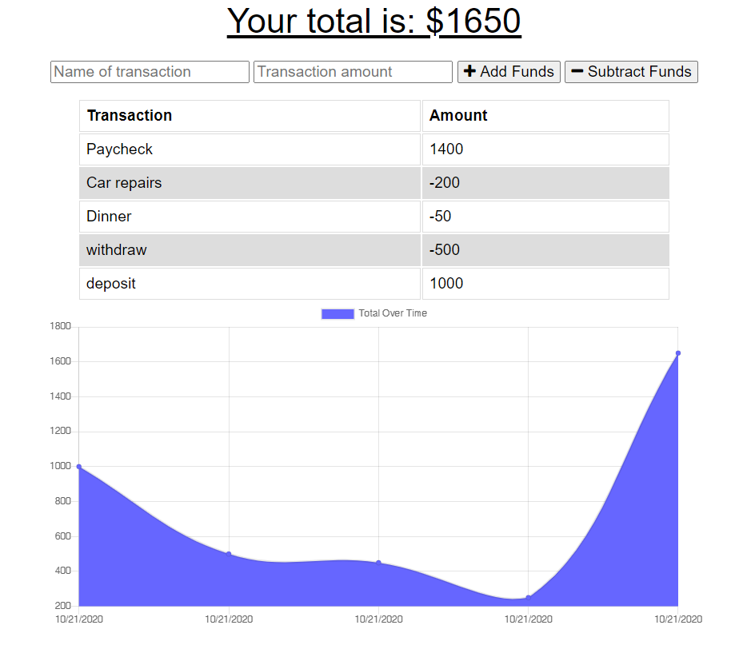

# Budget Tracker

  

  ## Table of Contents
  - [Description](#description)
  - [Installation Instructions](#install)
  - [Usage Information](#usage)
  - [Resources](#resources)
  - [Test](#test)
  - [License](#license)
  - [Questions](#questions)
  
  

  
  ## Description 
  
  A budget tracker that tracks withdrawals and deposits with or without a data/internet connection. Users can ensure that their account balance is accurate when traveling. This app runs on the Heroku server. 

[Watch Demo Video of Offline Updates](https://drive.google.com/file/d/1aPSV0KJWI7Op3v6HYSJS1FWO8tonMjLr/view?usp=sharing)

  ### User Story

As an avid traveller, I want to be able to track my withdrawals and deposits with or without a data/internet connection so that my account balance is accurate when I am traveling

  
  
  
  

  
  ## Installation Instructions 
  
  Web Application runs from the site. To install locally: 
  * npm install from package.json
  * node server.js
  
  Also requires installation of Mongo, and Robo 3T software locally.
  
  

  
  ## Usage 
  
  Allows users to add or subtract funds from budget tracker either online or offline. 
  
  

  
  ## Resources 
  
  MongoDB, MongoDB Atlas, Robo 3T, Node
  
  

  
  ## Test Information 
  
  None Available
  
  

  
  ## License 
  
  Please refer to the following license for guidelines, usage details, and information.
  
  License: MIT
  
  

  
  ## Questions 
  
  For any questions regarding this material, contact me at the following:
  
  Email: jaimeharman17@gmail.com
  
  Github: [https://github.com/jaimeharman](https://github.com/jaimeharman)
